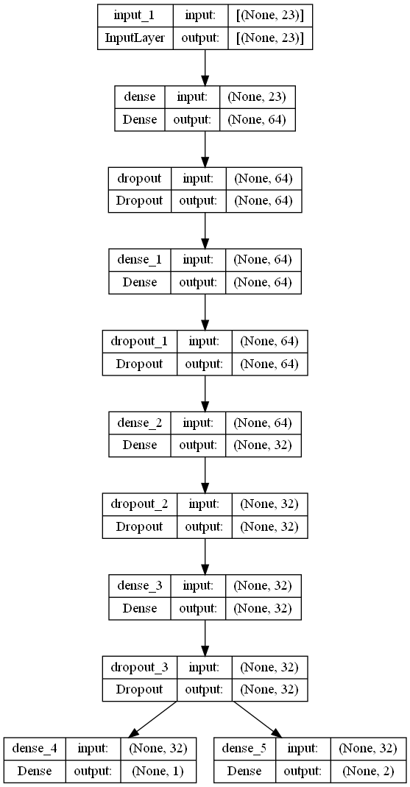
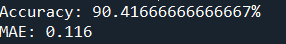
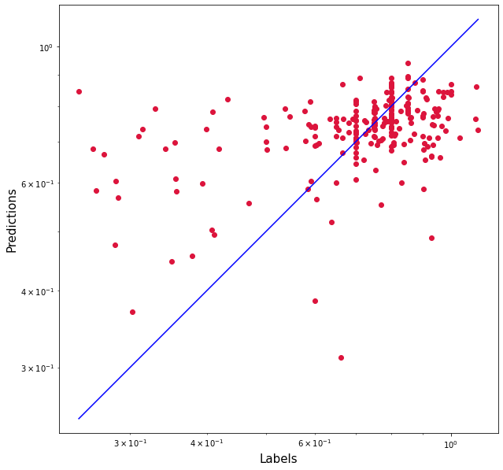

# Productivity Prediction of Garment Employees (TensorFlow Deep Learning)
## 1. Summary
The aim of this project is to create a model that can predict the employee's productivity.

## IDE and Framework
This project is built using Spyder and Visual Studio Code for the python and jupyter notebook respectively. 

The packages used in this project are Pandas, NumPy, Scikit-learn, TensorFlow Keras and Matplotlib.
 
## 3. Methodology

### 3.1 Dataset
The dataset was obtained from [UCI Machine Learning Repository](https://archive.ics.uci.edu/ml/datasets/Productivity+Prediction+of+Garment+Employees). It has 15 attributes.

#### Attribute Information

| # | Attributes|Descriptions|
|------|------|------|
|   1  | date  |Date in MM-DD-YYYY|     
|   2  | quarter  |  A portion of the month. A month was divided into four quarters|    
|   3  | department  | Associated department with the instance|
|   4  | day  |Day of the Week| 
|   5  | team  | Associated team number with the instance| 
|   6  | targeted_productivity  |Targeted productivity set by the Authority for each team for each day.|
|   7  | smv   |Standard Minute Value, it is the allocated time for a task|
|   8  | wip  |Work in progress. Includes the number of unfinished items for products|
|   9  | over_time  |Represents the amount of overtime by each team in minutes|
|   10  | incentive  |Represents the amount of financial incentive (in BDT) that enables or motivates a particular course of action.|
|   11  |idle_time |  The amount of time when the production was interrupted due to several reasons|
|   12  | idle_men  |The number of workers who were idle due to production interruption|
|   13  | no_of_style_change   |Number of changes in the style of a particular product|
|   14  | no_of_workers   |Number of workers in each team|
|   15  | actual_productivity   |The actual % of productivity that was delivered by the workers. It ranges from 0-1.

### 3.2 Data pipeline

The data is first loaded and preprocessed to properly split them into features and labels. In this project, we have 2 labels for regression and classification problems. Since the initial label for the data are continuous, we have created another label for the classification problem with the classes of 0 (Not Productive) and 1 (Productive).

Then, the data is split into train and test sets, with a ratio of 80:20.

### 3.3 Model pipeline
In order the perform both classification and regression for the same model, 2 different output layers are used. 
Figure below shows the structure of the model:

The model is trained with a batch size of 16 and for 50 epochs. Dropout is applied during training to reduce overfitting. After the model has stopped training, we have obtained a training accuracy of 92.58% and validation accuracy of 90.42%. The results of the training process are shown in the graph below:

## Results

Upon evaluating the model with test data, we have obtained the accuracy score and mean absolute error for the classification and regression model respectively. 

Using the predictions from the regression model, the graph of predictions against labels are as shown in the image below:

# License
Distributed under GNU General Public License v3.0. See [LICENSE](LICENSE) for more information.

# Acknowledgements
- [Kah Chun Kong - SHRDC Instructor ](https://github.com/ch4mploo/)
- [StackExchange on how to classify and regress on the same model](https://stats.stackexchange.com/questions/77330/classify-and-regress-at-the-same-time)
